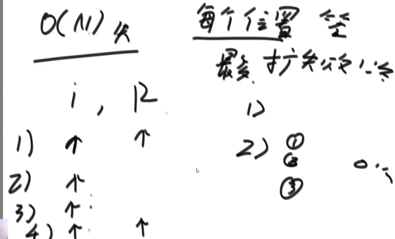

### 找到一个字符串中的最长回文字符串.

## 暴力搜索
对于一个字符串,搜索每个位置的左右两个字符进行比较,如果相等,就继续向外扩展,不相等时返回长度.
会有奇偶的问题:
1. 奇串可以不停地向两边扩展(例:11311),只要有最大值一定能找到; 
2. 偶串每次扩展都是不相等(例:113311),可能会错过.
为了统一考虑奇偶的可能性,使用插入特殊字符的方法:
#1#1#3#3#1#1
无论奇偶都使用这个串,将得到的结果/2即可(奇数除的时候会省略掉小数).
时间复杂度:O(n^2) --> 每一个位置的最差情况:一直找到两端.

## Manacher算法将时间复杂度优化至O(n).
一般的算法优化并没有绝对的优化,往往是用空间换时间,所以会需要一个O(n)的时间复杂度.
大致思路:将每次遍历的信息都存储在数组中,下次遍历可以直接使用.
需要了解的几个参数:
1. 之前扩的所有字符中所到达的最右回文边界,只增不减.
2. 取得更远边界时候的中心点位置.
3. 用数组记录每个字符的回文半径.回文半径:从当前字符往一边取,包含当前字符

### 如何利用回文半径数组前面的数据来优化时间复杂度?
正常循环字符串时,判断当前字符位置是否在回文右边界内;
1. 不在回文右边界时,直接暴力扩;
2. 在回文右边界内,继续拆分小情况:
   2.1 当前位置关于中心点的对称点(i1)的回文半径在L~R之间, i的答案等于i1的范围 
   2.2 i1的左侧已经出界了,那么i的右边界就是R.假设如果超出R,L-1=R+1.整体早就是回文了
   2.3 i1的回文半径等于L,压线了.那么i的右边界最小是R,但还得往前找.(加速了i到R)

整个数组求解完毕之后,遍历找到最大值即可(因为添加了#,回文串的长度就是当前字符串回文半径的大小).

### 时间复杂度分析

O(n) + O(1) + O(1) + O(n)
2,3两种情况为O(1);
1,4两种情况都是在不断地更新回文右边界,当回文右边界到末尾时,算法结束.
